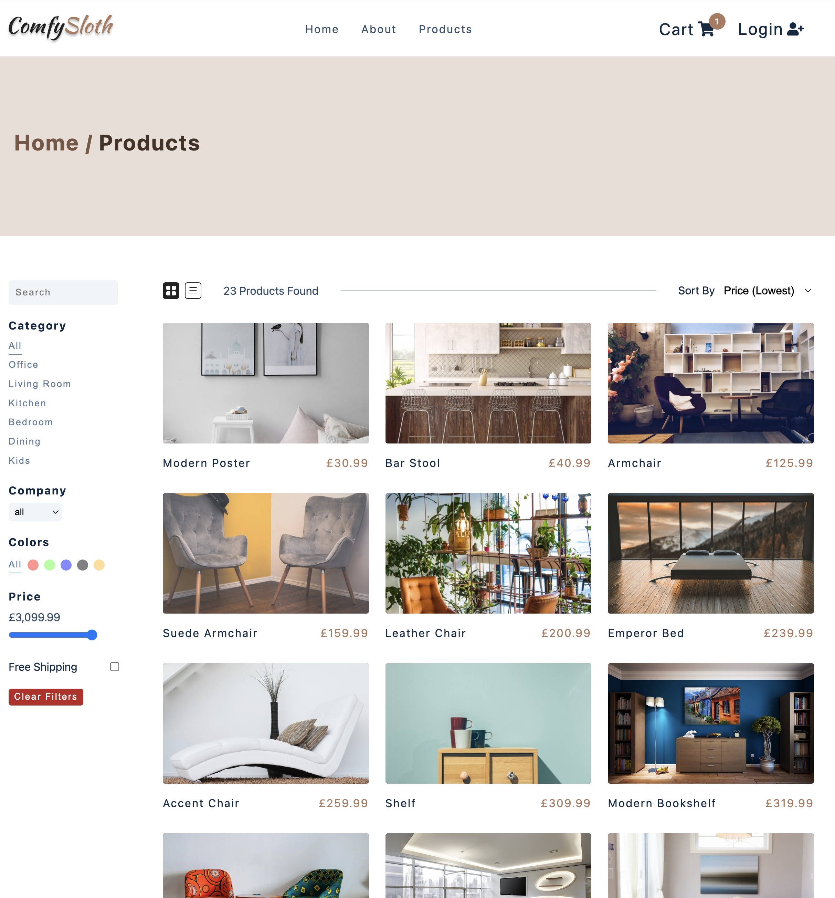

Build using react, useContext for state management, styled components for styling. Stripe for check out, OAuth for authentication and deployed on netlify.

ComfySloth is a fake demo eccomerce site. Allows user to add, remove, increase/ decrease cart items. Cart will calculate and format price values upon change. Checkout is powered with Stripe and Authentication by Oauth.

Products are retrieved from 3rd Party API.

https://comfyslothy.netlify.app

